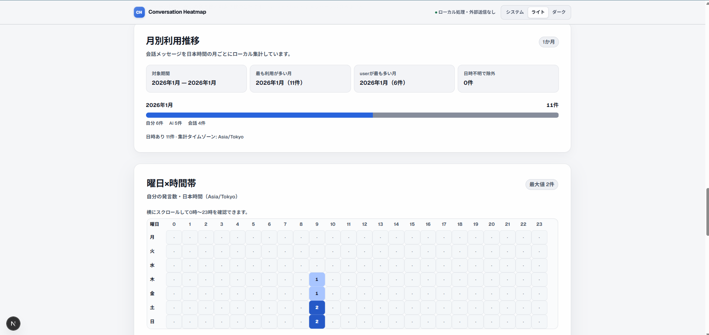
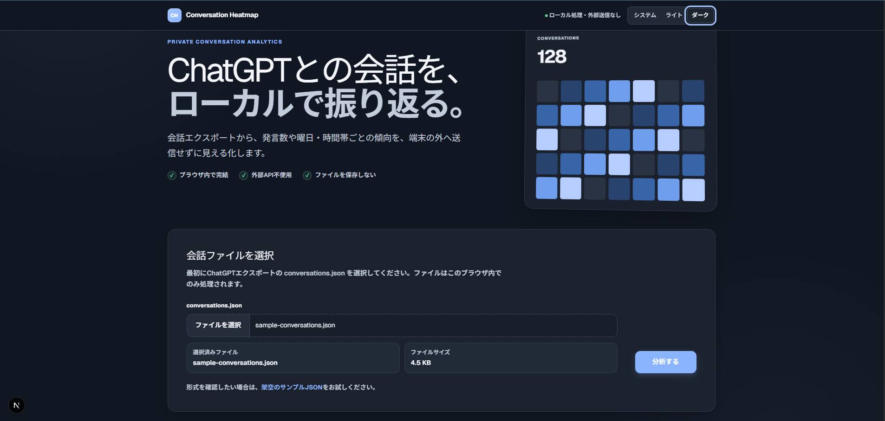
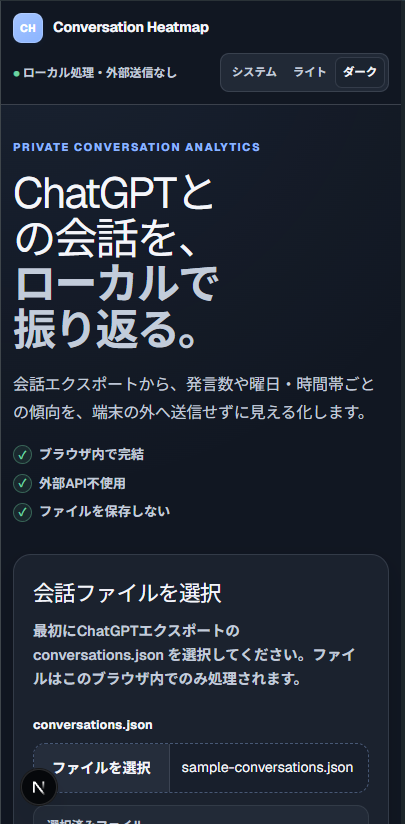

# ChatGPT Conversation Heatmap

ChatGPTエクスポートの`conversations.json`を、ブラウザ内で振り返るローカルファーストのWebアプリです。会話の基本統計、曜日・時間帯ヒートマップ、月別利用推移、頻出ワード、Wrapped表示をまとめて確認できます。

## v0.1.0 初回公開

## スクリーンショット

以下はすべて`public/sample-conversations.json`を使った画面です。実在の会話ログは含まれていません。

### PC表示



### テーマ・画面幅の違い

| ダークテーマ | スマホ幅の表示 |
| --- | --- |
|  |  |

### 主な機能

- 会話数、メッセージ数、ユーザー発言数、AI返信数の集計
- `mapping`構造と`current_node`から現在の会話経路を復元
- 曜日×時間帯ヒートマップ、月別アクティビティ、頻出ワード
- Wrapped形式の総合サマリー
- 大きなデータ向けの非同期チャンク処理、進捗表示、停止・再実行
- 解析結果のIndexedDB保存、読込、再保存、全削除
- 派生集計情報だけを出力するAI引き継ぎJSON v0.1
- ライト・ダークテーマ、レスポンシブ表示、キーボード操作とヒートマップのアクセシビリティ対応

### 対応入力形式

- ChatGPTエクスポートの`conversations.json`
- JSONファイルの手動選択（`.json`、`application/json`）
- ZIPファイルの直接読込は未対応

## プライバシーと外部通信

- アプリ実行中、会話データを外部API、クラウドDB、分析サービスへ送信しません。
- 選択したJSONはブラウザ内で読み込み・解析します。元のJSONファイル自体は保存しません。
- 「ブラウザに保存」を選択した場合、解析済みの会話タイトルとメッセージ本文をブラウザ内のIndexedDBへ保存します。
- 共有PCでは保存データを残さないか、利用後に「保存済みデータをすべて削除」を実行してください。
- AI引き継ぎJSON v0.1には、元の会話本文、メッセージ本文、会話タイトル、会話ID、元ファイル名、ローカルパスを出力しません。一方、本文から抽出した頻出語などの派生集計情報は含まれるため、公開・共有前に内容を確認してください。
- `next/font/google`を使用しているため、アプリをビルドするときにフォント取得の外部通信が発生する可能性があります。この通信に会話データは含まれません。
- 実在のログ、個人情報、認証情報、`.env`ファイルをリポジトリへ追加しないでください。

## セットアップと使い方

開発・CIの基準環境はNode.js 24とnpmです。

```powershell
git clone <repository-url>
cd conversation-heatmap-app
npm install
npm run dev
```

ブラウザで`http://localhost:3000`を開き、次の手順で解析します。

1. ChatGPTからエクスポートした`conversations.json`を選択します。
2. 「分析する」を選択します。ファイルはブラウザ内だけで処理されます。
3. 手元にファイルがない場合は、画面の「架空のサンプルJSON」をダウンロードして選択します。サンプルは実在の会話ログを含まないテスト用データです。
4. 必要に応じて解析結果をIndexedDBへ保存し、AI引き継ぎJSON v0.1を出力します。

## 対応環境

- 開発・ビルド：Node.js 24、npm
- ブラウザ：File API、IndexedDB、localStorage、現行のCSS機能を利用できる最新のChrome / Edge / Firefox / Safariを想定
- 正式なブラウザ別サポートマトリクスはまだ策定していません
- UIは現在日本語のみです

## 検証

通常の検証コマンドは次のとおりです。

```powershell
npm test
npm run lint
npm run build
git diff --check
```

Windows環境でVitestの起動時に`spawn EPERM`が発生する場合は、単一workerで再実行してください。

```powershell
npm test -- --pool=threads --no-file-parallelism --maxWorkers=1
```

GitHub Actionsは、pull requestと`main`へのpushでテスト、lint、build、`git diff --check`を実行します。

## 大容量データの確認

100会話・1,000会話の架空データは通常テストで確認します。10,000会話の負荷テストは通常テストから分離しています。実行方法と測定方針は[大容量ログの確認手順](docs/large-log-resilience.md)を参照してください。

解析は会話単位の非同期チャンクで進み、進捗表示と停止操作に対応します。ただし、非常に大きな単一JSONの`JSON.parse`中や、非常に大きな単一会話の正規化中は、停止操作が一時的に反映されない可能性があります。これはv0.1の既知の制限です。

## 既知の制限と依存関係 advisory

- UIは日本語のみです。
- ZIPの直接読込、期間比較、Web Workerは未対応です。
- 非常に大きな単一JSONまたは単一会話では停止操作の反映が遅れる可能性があります。
- 2026-07-20のライブ`npm audit`ではmoderate 2件（同一advisoryが`next`と内包`postcss`の2ノードに波及）、high/critical 0件でした。
- Next.jsが内包する`postcss@8.4.31`について、`GHSA-qx2v-qp2m-jg93`（未エスケープの`</style>`によるXSS、moderate）のadvisoryがあります。`next@16.2.10`の直接・本番依存を通じて、ビルド時のCSS処理が主な到達経路です。
- 現在のアプリはユーザー入力をCSS処理へ渡さず、会話データをCSSとして解釈しません。そのため、通常の本番リクエストでの直接的な到達性は限定的と判断しています。
- `postcss >=8.5.10`が修正版ですが、現行stable版Next.jsに対応版が提供されるまで、canary版の採用や自動修正は行いません。stable版の修正版が提供され次第、依存関係を更新して`npm audit`、テスト、lint、buildを再検証します。
- AI APIとの直接接続やクラウドへのアップロードは行いません。

## 今後の予定

- stable版Next.jsの修正版反映と公開前の再監査
- ZIP直接読込と期間比較
- 対応ブラウザの実機マトリクス整備
- 公開後の利用例の拡充

## ライセンス

MIT Licenseです。詳細は[LICENSE](LICENSE)を参照してください。
